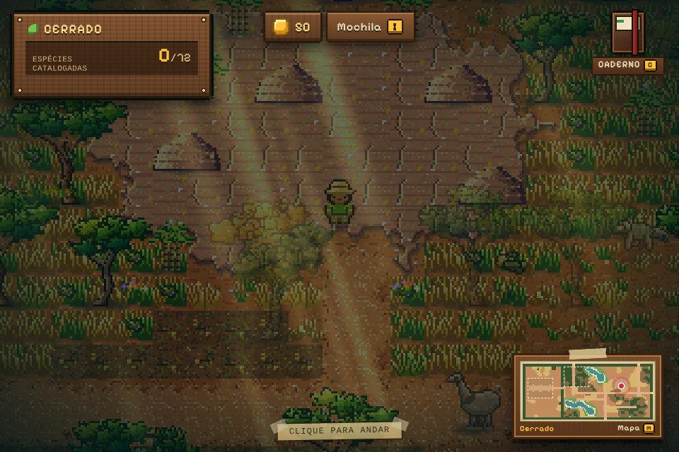

# Fauna Brasil

Jogo de exploração e captura da fauna dos seis biomas brasileiros (Amazônia, Caatinga, Cerrado, Pantanal, Mata Atlântica e Pampa), feito com Phaser 4, Vite e TypeScript. Há 72 espécies para encontrar. Toda a arte e a trilha sonora são geradas por código, sem arquivos de imagem ou áudio.

## O jogo

| | |
| --- | --- |
|  |  |
| Pantanal: baía com jacarés e a trilha da cordilheira. | Cerrado: chapada com cupinzeiros e árvores retorcidas. |
|  |  |
| Vila com moradores, loja e Centro de Conservação. | Batalha por turnos contra um animal de grande porte. |
|  |  |
| Captura com a rede, sem ferir o bicho. | Caderno de campo (Faunadex) com as espécies catalogadas. |

Os prints são gerados pelos testes de fumaça (`npm run e2e`, em `e2e/prints/`) e os escolhidos ficam em `docs/capturas/`.

## Desenvolvimento

```bash
npm install     # instala o projeto e, pelo postinstall, o ESLint isolado em tools/lint
npm run dev     # servidor de desenvolvimento (Vite)
```

Para gerar o build de produção: `npm run build`. Para ver o resultado: `npm run preview`.

## Controles

| Ação | Como |
| --- | --- |
| Andar | Clique no chão |
| Ir até um animal (e iniciar o encontro) | Clique no animal |
| Conversar com um morador da vila | Clique nele |
| Atravessar para outra região | Ande até a saída marcada na borda do mapa |
| Caderno de espécies | `C` ou `Tab` (fechar: `Esc`; navegar: setas, `PageUp`/`PageDown`) |
| Mochila | `I` (fora de encontros) |
| Minimapa | `M` (fechar: `Esc`) |
| Ligar/desligar o som | `N` |
| Escolher o inicial | Clique no cartão ou teclas `1` a `3`; `Enter` confirma |
| Batalha | Clique nos golpes ou teclas `1` a `4`; botões Trocar e Fugir |
| Captura | Arraste a rede para cima e solte; `Esc` foge |
| Fechar diálogo, loja ou mochila | `Esc` |

O guia completo está em [docs/jogar.md](docs/jogar.md).

## Parâmetros de URL para desenvolvimento

Funcionam com `npm run dev` (os marcados com * valem só no modo de desenvolvimento).

| Parâmetro | Efeito |
| --- | --- |
| `?region=cerrado` | Começa na região indicada (ids: `amazonia`, `caatinga`, `cerrado`, `pantanal`, `mata-atlantica`, `pampa`) |
| `?at=nome` | Posiciona o jogador num ponto nomeado (`places`) da região |
| `?capture=onca&habitat=agua` * | Abre a captura direto |
| `?battle=onca&habitat=agua&lv=6` * | Abre o encontro completo (batalha e captura); sem save usa um time de teste |
| `?gallery` * | Galeria de tiles e retratos; `?gallery=texto` rola até o primeiro título que contém o texto |
| `?starter` * | Força a tela de escolha do inicial (sem gravar) |
| `?nostarter` * | Pula a escolha do inicial |
| `?demo=caderno` * | Abre o caderno com 5 espécies marcadas, sem gravar |
| `?fauna=<id>` * | Põe um animal dessa espécie perto do jogador na exploração |
| `?canvas` * | Força o renderizador Canvas |

No console, em desenvolvimento, `__game`, `__ui` e `__village` dão acesso ao jogo e à interface.

## Documentação

- [Guia do jogador](docs/jogar.md)
- [Arquitetura](docs/arquitetura.md)
- [Como adicionar conteúdo](docs/conteudo.md) (espécies, biomas, vilas e dados IUCN)
- [Como contribuir](CONTRIBUTING.md)

## Roadmap

Ainda não existem, e estão em issues abertas: ginásios (#3) e chefes (#4). A preservação (Centro de Conservação) já está na main; veja o [guia do jogador](docs/jogar.md#centro-de-conservação).

## Qualidade

Resumo; os detalhes (fluxo de branches, commits e testes) estão em [CONTRIBUTING.md](CONTRIBUTING.md).

| Comando | O que faz |
| --- | --- |
| `npm run lint` | ESLint (typescript-eslint, regras recomendadas, sem regras que exigem o programa do TypeScript) |
| `npx tsc --noEmit` | Checagem de tipos |
| `npm test` | Testes unitários com Jest e relatório de cobertura (`coverage/`) |
| `npm run build` | Checagem de tipos e build de produção com Vite |
| `npm run e2e` | Testes de fumaça no navegador (Playwright, só Chromium); salvam um PNG por cenário em `e2e/prints/` |

Os testes ficam ao lado do código (`src/**/*.test.ts`) e cobrem só módulos puros, sem canvas. Importe `describe`, `it` e `expect` de `@jest/globals`. O CI roda em PRs e em pushes para `main`, em três workflows: `Lint` (`.github/workflows/lint.yml`: ESLint e `tsc --noEmit`), `Tests` (`.github/workflows/tests.yml`: Jest e build) e `E2E` (`.github/workflows/e2e.yml`: Playwright, com os prints como artefato `e2e-prints`).

### Testes no navegador (`e2e/`)

Um servidor `vite` em modo de desenvolvimento (porta 5199) sobe sozinho; o Playwright abre as 6 regiões, `?starter`, `?battle`, `?capture`, `?demo=caderno`, a loja e o Centro de Conservação da vila, o minimapa (`M`) e a mochila (`I`). Qualquer `pageerror` ou `console.error` reprova o cenário, e cada print precisa ter muitas cores (um canvas vazio falha). Não há comparação pixel a pixel.

- Sem GPU, o canvas 2D acelerado por SwiftShader tornava a pintura procedural do boot ~15x mais lenta (~70 s) e os prints saíam em branco; por isso o Chromium roda com `--disable-accelerated-2d-canvas` (WebGL continua por software).
- `PW_CHROMIUM_PATH` aponta para um Chromium já instalado, se o do Playwright não estiver disponível.
- O spawn do Cerrado fica na transição amazônica (parece floresta); os cenários usam `?at=<ponto>` para cair no bioma.

### Por que há um `tools/lint`?

O TypeScript 7 é o compilador nativo e não expõe a API JavaScript que o typescript-eslint exige (suporta até o 6.0). Por isso o ESLint vive em `tools/lint` com o seu próprio `package.json` e o TypeScript 5.9, sem afetar o `tsc` do build. O mesmo motivo faz o Jest usar Babel (`babel.config.cjs`) em vez do ts-jest. Quando o typescript-eslint suportar o TypeScript 7, basta mover as dependências para a raiz.
