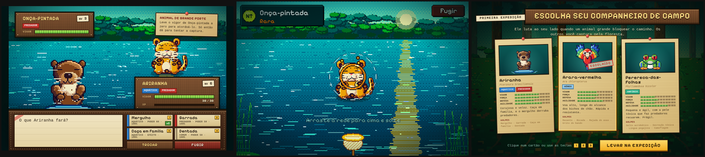

# Fauna Brasil

Jogo de exploração e captura da fauna dos seis biomas brasileiros (Amazônia, Caatinga, Cerrado, Pantanal, Mata Atlântica e Pampa), feito com Phaser 4, Vite e TypeScript. Há 72 espécies para encontrar. Toda a arte e a trilha sonora são geradas por código, sem arquivos de imagem ou áudio.



Da esquerda para a direita: batalha por turnos, captura com a rede e escolha do companheiro inicial.

## Desenvolvimento

```bash
npm install     # instala o projeto e, pelo postinstall, o ESLint isolado em tools/lint
npm run dev     # servidor de desenvolvimento (Vite)
```

Para gerar o build de produção: `npm run build`. Para ver o resultado: `npm run preview`.

## Controles

| Ação | Como |
| --- | --- |
| Andar | Clique no chão |
| Ir até um animal (e iniciar o encontro) | Clique no animal |
| Conversar com um morador da vila | Clique nele |
| Atravessar para outra região | Ande até a saída marcada na borda do mapa |
| Caderno de espécies | `C` ou `Tab` (fechar: `Esc`; navegar: setas, `PageUp`/`PageDown`) |
| Mochila | `I` (fora de encontros) |
| Minimapa | `M` (fechar: `Esc`) |
| Ligar/desligar o som | `N` |
| Escolher o inicial | Clique no cartão ou teclas `1` a `3`; `Enter` confirma |
| Batalha | Clique nos golpes ou teclas `1` a `4`; botões Trocar e Fugir |
| Captura | Arraste a rede para cima e solte; `Esc` foge |
| Fechar diálogo, loja ou mochila | `Esc` |

O guia completo está em [docs/jogar.md](docs/jogar.md).

## Parâmetros de URL para desenvolvimento

Funcionam com `npm run dev` (os marcados com * valem só no modo de desenvolvimento).

| Parâmetro | Efeito |
| --- | --- |
| `?region=cerrado` | Começa na região indicada (ids: `amazonia`, `caatinga`, `cerrado`, `pantanal`, `mata-atlantica`, `pampa`) |
| `?at=nome` | Posiciona o jogador num ponto nomeado (`places`) da região |
| `?capture=onca&habitat=agua` * | Abre a captura direto |
| `?battle=onca&habitat=agua&lv=6` * | Abre o encontro completo (batalha e captura); sem save usa um time de teste |
| `?gallery` * | Galeria de tiles e retratos; `?gallery=texto` rola até o primeiro título que contém o texto |
| `?starter` * | Força a tela de escolha do inicial (sem gravar) |
| `?nostarter` * | Pula a escolha do inicial |
| `?demo=caderno` * | Abre o caderno com 5 espécies marcadas, sem gravar |
| `?fauna=<id>` * | Põe um animal dessa espécie perto do jogador na exploração |
| `?canvas` * | Força o renderizador Canvas |

No console, em desenvolvimento, `__game`, `__ui` e `__village` dão acesso ao jogo e à interface.

## Documentação

- [Guia do jogador](docs/jogar.md)
- [Arquitetura](docs/arquitetura.md)
- [Como adicionar conteúdo](docs/conteudo.md) (espécies, biomas, vilas e dados IUCN)
- [Como contribuir](CONTRIBUTING.md)

## Roadmap

Ainda não existem, e estão em issues abertas: preservação (#2), ginásios (#3) e chefes (#4).

## Qualidade

Resumo; os detalhes (fluxo de branches, commits e testes) estão em [CONTRIBUTING.md](CONTRIBUTING.md).

| Comando | O que faz |
| --- | --- |
| `npm run lint` | ESLint (typescript-eslint, regras recomendadas, sem regras que exigem o programa do TypeScript) |
| `npx tsc --noEmit` | Checagem de tipos |
| `npm test` | Testes unitários com Jest e relatório de cobertura (`coverage/`) |
| `npm run build` | Checagem de tipos e build de produção com Vite |

Os testes ficam ao lado do código (`src/**/*.test.ts`) e cobrem só módulos puros. O CI roda em PRs e em pushes para `main`, em dois workflows: `Lint` (ESLint e `tsc --noEmit`) e `Testes` (Jest e build). Detalhes de testes, o motivo de `tools/lint` e o fluxo de contribuição estão em [CONTRIBUTING.md](CONTRIBUTING.md).
