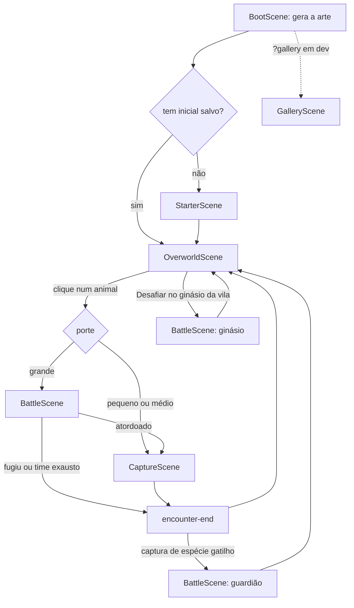

# Arquitetura

O jogo roda no navegador com Phaser 4 (cenas e jogo), Vite (build) e TypeScript. A interface fora do canvas (caderno, minimapa, loja, batalha) é HTML e CSS sobre o canvas.

## Organização de `src/`

| Pasta | Conteúdo |
| --- | --- |
| `main.ts` | Cria o `Phaser.Game`, liga estado e interface aos eventos e inicia a trilha |
| `scenes/` | Cenas do Phaser: `BootScene`, `StarterScene`, `OverworldScene`, `CaptureScene`, `BattleScene`, `GalleryScene` (e `LightLayer.ts`, camada de luz da exploração) |
| `world/` | Lógica da exploração: grade e áreas andáveis (`grid.ts`), caminhos (`pathfind.ts`), sorteio de espécies por habitat (`encounters.ts`), animais soltos no mapa (`fauna.ts`), geração de vilas (`village.ts`) |
| `capture/` | Regras da captura (`rules.ts`, puras), comportamento do animal (`behavior.ts`) e gesto de arremesso (`throw.ts`) |
| `battle/` | Motor da batalha (`engine.ts`), fluxo do encontro (`flow.ts`) e utilitários de interface (`ui.ts`). Desafios especiais: ginásio (`gym.ts`, fluxo) e guardião (`legend.ts`, regras puras das fases; `legendFlow.ts`, fluxo) |
| `state/` | Estado persistente: time e vigor (`party.ts`), moedas e mochila (`bag.ts`), o Centro de Conservação (`conservation.ts`: DNA, incubadoras, fazenda e reputação), insígnias e progresso do ginásio (`gyms.ts`) e guardiões vencidos (`legends.ts`) |
| `ui/` | Interface HTML: caderno (`GameUI.ts`, `dex.ts`), minimapa, vila (diálogo, loja, mochila) e formatação; o painel do Centro de Conservação fica em `conservation.ts` e o do ginásio em `gym.ts` |
| `art/` | Arte procedural (veja abaixo) |
| `audio/` | Trilha sintetizada (`music.ts`, `synth.ts`) |
| `biomes/` | Um bioma por pasta (Cerrado, Pantanal, Mata Atlântica, Pampa), mais o contrato em `types.ts` e os registros `env.ts` e `fauna.ts` |
| `data/` | Dados: espécies (`species.ts`), batalha (`battle.ts`), itens (`items.ts`), vilas (`villages.ts`), biomas (`biomes.ts`), tipos (`types.ts`), regiões (`regions/`), regras do Centro de Conservação (`conservation.ts`, funções puras), ginásios (`gyms.ts`) e guardiões do folclore (`legends.ts`) |

Amazônia e Caatinga são anteriores ao contrato `src/biomes/`: suas espécies estão em `src/data/species.ts` e suas regiões em `src/data/regions/`. Os outros quatro biomas seguem o contrato descrito em `src/biomes/types.ts`.

## Fluxo de cenas

- `BootScene` pinta todas as texturas e decide a primeira cena (inclusive os atalhos de URL de desenvolvimento).
- `OverworldScene` é reiniciada a cada mudança de região (`{ region: id }`). Ao pisar numa saída, há um fade e a cena abre a região de destino.
- `Battle` e `Capture` são executadas por cima da exploração (`game.scene.run`), que fica congelada até o fim do encontro. O fluxo está em `src/battle/flow.ts` (`beginEncounter`).
- Ginásio e guardião também usam a `BattleScene`, em modos próprios, sem captura nem fuga. O ginásio é iniciado por `beginGym` (`src/battle/gym.ts`), chamado por `OverworldScene.startGym` ao clicar em "Desafiar" no painel do líder. O guardião é iniciado por `beginLegend` (`src/battle/legendFlow.ts`) logo depois de uma captura que o desperta (`OverworldScene.startCapture`, ~0,9 s depois do fim da captura).
- Painéis HTML abertos (caderno, loja, mochila) pausam a exploração (`setUiModal` em `main.ts`).

## Eventos de `game.events`

| Evento | Emitido por | Dados | Ouvido por |
| --- | --- | --- | --- |
| `region-enter` | `OverworldScene` | `{ id, name }` | `main.ts` (painel e trilha), minimapa |
| `player-move` | `OverworldScene` | `{ region, x, y }` | minimapa |
| `npc-talk` | `OverworldScene` | `{ npc, regionId }` | `ui/village.ts` (abre o diálogo) |
| `encounter-start` | `beginEncounter` | `{ speciesId, habitat, level }` | `GameUI` (marca como vista) |
| `battle-done` | `BattleScene` | `{ speciesId, result }` | `battle/flow.ts` (interno) |
| `capture-done` | `CaptureScene` | `{ speciesId, result }` | `battle/flow.ts` e `GameUI` |
| `encounter-end` | `battle/flow.ts` | `{ speciesId, habitat, level, result }` | `OverworldScene`, `party`, `bag`, `conservation` |
| `coins-earned` | `bindBag` | `{ amount }` | `ui/village.ts` |
| `gym-end` | `battle/gym.ts` | `{ regionId, result }` (`won` ou `lost`), emitido uma vez | `OverworldScene.startGym`, `BootScene` (`?gym=`) |
| `legend-end` | `battle/legendFlow.ts` | `{ legendId, result }` (`won` ou `lost`), emitido uma vez | `OverworldScene.startLegend`, `BootScene` (`?legend=`) |
| `dna-collected` | `bindConservation` (`state/conservation.ts`) | `{ speciesId, amount }` | `GameUI` (`onDna`) |

`encounter-end` é emitido exatamente uma vez por encontro, com `result` igual a `captured`, `fled`, `ran` ou `lost`. O contrato completo está no comentário de `src/battle/flow.ts`.

Ginásio e guardião não passam por `encounter-end`: cada um tem o seu fim (`gym-end` e `legend-end`), com `won` ou `lost`. A `BattleScene` emite `battle-done` ao terminar a luta, e `battle/gym.ts` e `battle/legendFlow.ts` escutam esse evento; cada fluxo se desliga depois de receber o seu.

## Estado salvo

Tudo fica em `localStorage`. Sem ele o jogo funciona, só não lembra. Cada leitura e escrita está num `try/catch`. Ids inválidos ou que não existem mais no código são ignorados ao carregar.

| Chave | Arquivo | Conteúdo |
| --- | --- | --- |
| `fauna-brasil:party:v1` | `src/state/party.ts` | Coleção (`members`), time (`team`) e último tick de vigor |
| `fauna-brasil:mochila:v1` | `src/state/bag.ts` | Moedas, itens, uso da rede reforçada e fim da isca |
| `fauna-brasil:caderno:v1` | `src/ui/GameUI.ts` | Espécies capturadas e vistas e dica de primeiro uso |
| `fauna-brasil:conservacao:v1` | `src/state/conservation.ts` | DNA por espécie (`dna`), incubadoras (`slots`), fazenda de filhotes (`farm`) e reputação |
| `fauna-brasil:ginasios:v1` | `src/state/gyms.ts` | Ids dos ginásios vencidos (`badges`). O progresso da sequência de batalhas não é salvo: um desafio interrompido recomeça do primeiro animal |
| `fauna-brasil:lendas:v1` | `src/state/legends.ts` | Ids dos guardiões vencidos (`defeated`). Guardião derrotado nunca mais desperta |

A trilha guarda a escolha de som numa chave própria (`fauna-brasil:mudo`, em `src/audio/music.ts`). Ao mudar o formato de um save, aumente o sufixo `:v1` e trate o save antigo.

## Arte procedural

Nenhuma imagem é carregada. `BootScene.create` chama funções `paint*` que desenham em canvas 2D (classe `Painter` em `src/art/canvas.ts`, tile de 16 px) e registram os resultados como texturas do Phaser:

- Tiles e objetos: `forest.ts` (registros `TILESETS` e `PROPS`), `forestTiles.ts`, `caatingaTiles.ts`, `caatingaProps.ts` e `src/biomes/<bioma>/tiles.ts` e `props.ts`.
- Animais: retratos e quadros de combate em `src/art/animals/` (registro `DRAWERS` em `index.ts`) e sprites da exploração em `src/art/wildlife/` (`OW_DRAWERS`).
- Explorador, moradores e vila: `explorer.ts`, `npc.ts`, `village.ts`.
- Fundos da captura e da batalha: `captureBg.ts` e `captureBackgrounds.ts`.

Os quatro biomas novos registram sua arte em `src/biomes/env.ts` (ambiente) e `src/biomes/fauna.ts` (animais). A pasta de um bioma não importa nada de outro.

## Trilha sonora

`src/audio/music.ts` é um sequenciador sobre Web Audio. Cada humor (`Mood`: as seis regiões, `capture` e `battle`) tem andamento, escala, progressão e ritmo próprios, com sorteio de semente fixa, então a faixa soa igual a cada volta. Os instrumentos são sintetizados na hora em `src/audio/synth.ts`, sem arquivos de áudio. `main.ts` escolhe o humor a cada 250 ms conforme a cena ativa.

## Testes

Ficam em `src/**/*.test.ts` e cobrem módulos puros (`capture/rules`, `battle/engine`, `state/bag`, `world/village`, `world/encounters`), o estado do Centro de Conservação (`state/conservation`, com `state/integration` para o fluxo de captura, DNA e incubadoras), os ginásios (`state/gyms`: sequência, insígnia e revanche) e os guardiões (`state/legends`, `data/legends`: gatilhos, fases e recompensas). Veja [CONTRIBUTING.md](../CONTRIBUTING.md#testes).

Os testes no navegador (`e2e/`, Playwright) ficam fora do Jest; veja [CONTRIBUTING.md](../CONTRIBUTING.md#testes-no-navegador-e2e).
