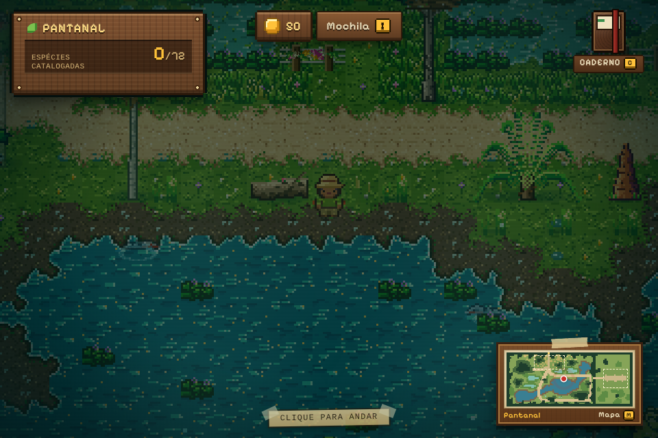
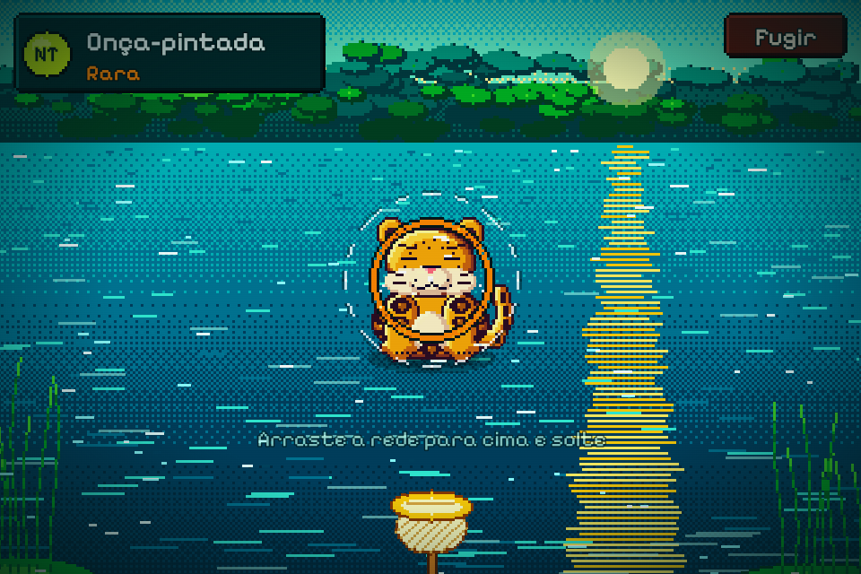
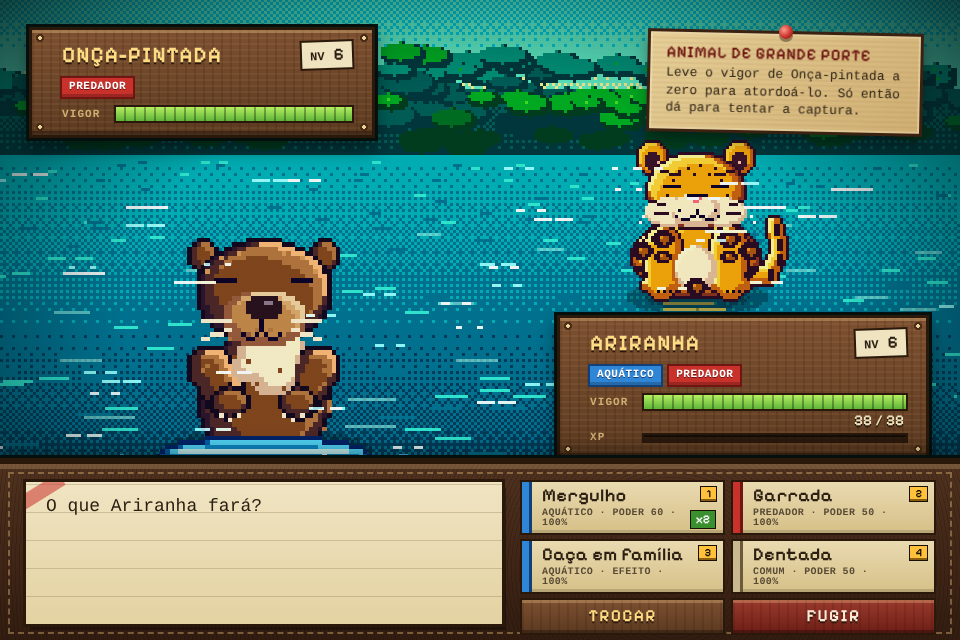
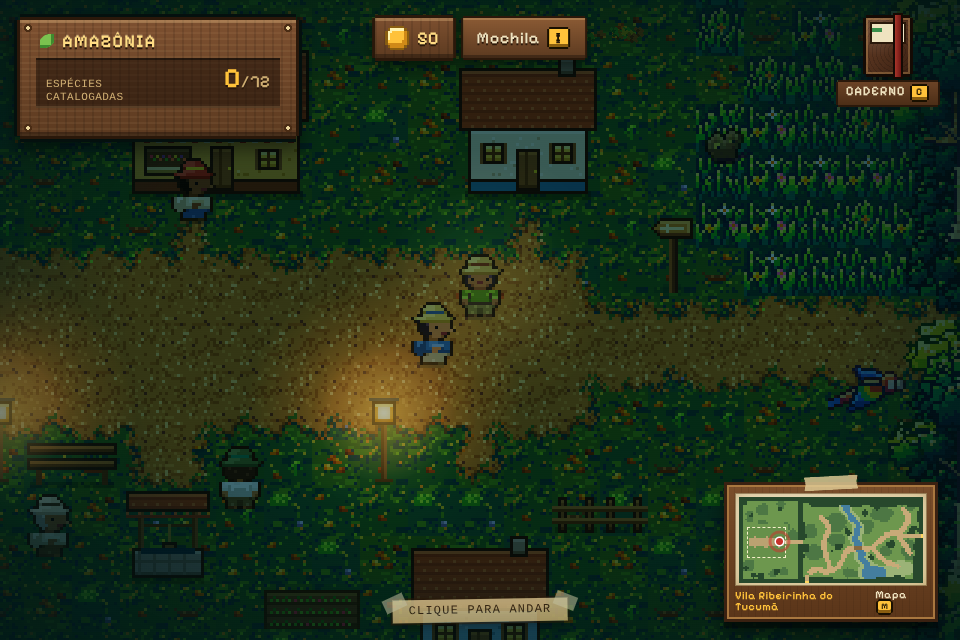
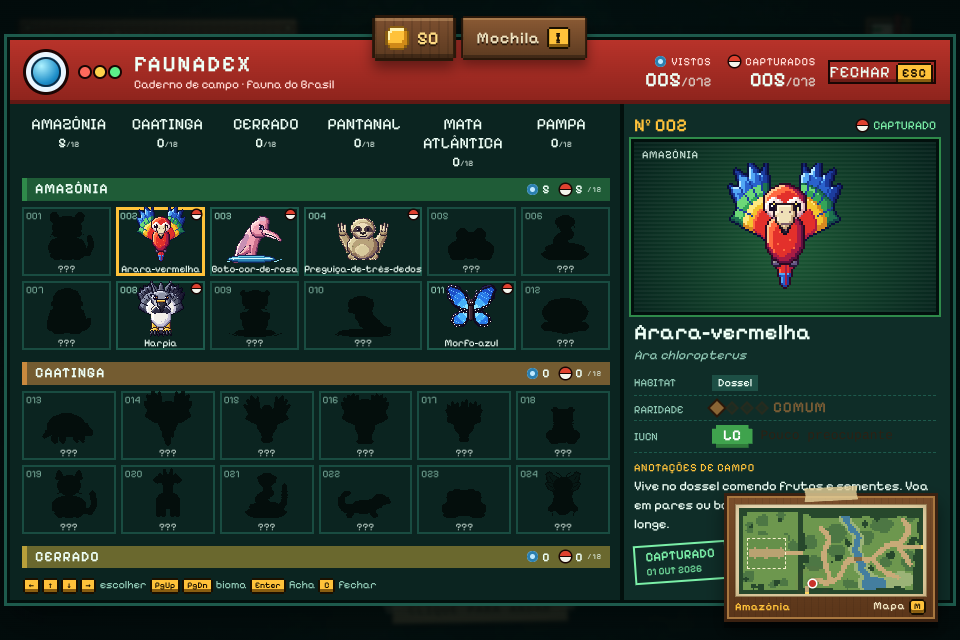

# Guia do jogador

## Começo

Na primeira vez você escolhe um companheiro de expedição: ariranha, arara-vermelha ou perereca-das-folhas. Ele luta ao seu lado quando um animal grande bloqueia o caminho. O progresso é salvo no navegador (veja [arquitetura](arquitetura.md#estado-salvo)).

## Explorar

- Clique no chão para andar. Clique num animal para ir até ele e iniciar o encontro.
- O jogo tem seis regiões, uma por bioma: Amazônia, Caatinga, Cerrado, Pantanal, Mata Atlântica e Pampa. O nome da região aparece no painel do caderno.
- Cada animal vive em certos habitats (água, campo, mata seca etc.). Procure-o onde ele costuma aparecer; o caderno mostra o habitat de cada espécie.
- `M` abre o minimapa.

### Saídas entre regiões

Cada saída fica na borda do mapa e mostra o nome do destino ao passar o mouse. Basta andar até ela.

| Região | Saídas para |
| --- | --- |
| Amazônia | Caatinga, Cerrado |
| Caatinga | Amazônia, Cerrado, Mata Atlântica |
| Cerrado | Amazônia, Caatinga, Pantanal, Mata Atlântica |
| Pantanal | Cerrado |
| Mata Atlântica | Caatinga, Cerrado, Pampa |
| Pampa | Mata Atlântica |

## Encontros

- **Animal pequeno ou médio:** vai direto para a captura.
- **Animal grande:** primeiro há uma batalha por turnos. Se você zerar o vigor dele, ele fica atordoado e a captura começa.

## Captura

1. Arraste a rede para cima e solte (um gesto rápido para cima lança a rede; soltá-la parada, depois de subi-la, também vale como arremesso).
2. Um anel colorido encolhe sobre o animal. A cor indica a raridade.
3. Quanto menor o anel no momento em que a rede acerta, melhor a qualidade ("Boa!", "Ótimo!", "Excelente!"). Se a rede cai fora do anel, a qualidade é zero.
4. Com boa qualidade a chance de captura aumenta. A rede balança três vezes antes de fechar.
5. Animal atordoado na batalha tem qualidade mínima garantida.
6. `Esc` abandona a captura.

Animais mais raros são mais difíceis. A rede reforçada (item da loja) aumenta a chance e evita que o bicho fuja se escapar.

## Batalha

- Escolha um golpe com o mouse ou com as teclas `1` a `4`.
- Os tipos (Predador, Aquático, Aéreo, Réptil, Anfíbio, Inseto, Elétrico, Arbóreo e Comum) têm vantagens e desvantagens entre si. Cada golpe mostra o tipo e o poder.
- **Trocar** muda o animal em campo. **Fugir** encerra o encontro.
- Se todo o time ficar exausto, você volta ao acampamento e todos recuperam o vigor.

## Time e vigor

- O time tem até 6 animais; os capturados entram na coleção.
- O vigor volta com o tempo: 5% do máximo a cada 10 segundos.
- Ao fim de um encontro, quem ficou exausto volta com 25%.
- Vitórias e capturas dão experiência; animais sobem de nível.
- A cesta de frutas e a erva medicinal recuperam vigor (veja abaixo).

## Ginásios

Cada bioma tem um ginásio, com um líder que é morador da vila (aparece como "Líder de ginásio"). Clique nele e escolha **Ver o desafio**: o painel mostra o time do líder, se você já tem a insígnia e quantas insígnias já conquistou (de 6).

| Ginásio | Líder | Bioma | Insígnia | Time do líder (nível) | Moedas na 1ª vitória |
| --- | --- | --- | --- | --- | --- |
| Ginásio da Vitória-Régia | Jurema | Amazônia | Insígnia da Vitória-Régia | ariranha (6), sucuri (8), onça-pintada (10) | 120 |
| Ginásio do Mandacaru | Seu Quincas | Caatinga | Insígnia do Mandacaru | tatu-bola (7), cascavel (9), onça-parda (11) | 140 |
| Ginásio do Pequi | Dona Cida | Cerrado | Insígnia do Pequi | ema (8), tatu-canastra (10), lobo-guará (12) | 160 |
| Ginásio do Tuiuiú | Tião Pantaneiro | Pantanal | Insígnia do Tuiuiú | capivara (9), jacaré-do-pantanal (11), jaguatirica (13) | 180 |
| Ginásio da Araucária | Araci | Mata Atlântica | Insígnia da Araucária | ouriço-cacheiro (10), jararaca (12), muriqui-do-sul (14) | 200 |
| Ginásio do Butiá | Tarso | Pampa | Insígnia do Butiá | graxaim-do-campo (11), quero-quero (13), veado-campeiro (15) | 220 |

- **Como funciona:** a luta é uma sequência de batalhas 1x1. Cada animal do líder entra depois que o anterior cai. Não há captura nem fuga.
- **Vitória:** vencer o time inteiro dá a insígnia. As moedas vêm só na primeira vitória; revanches mantêm a insígnia, mas não pagam de novo.
- **Derrota:** se o seu time ficar exausto, o desafio termina sem insígnia. O time volta ao acampamento com o vigor recuperado (como em qualquer derrota) e você pode tentar de novo.

## Guardiões do folclore

Cada bioma também abriga um guardião das lendas brasileiras. Ele dorme até você capturar uma das espécies gatilho do próprio bioma (a captura precisa dar certo; fugir ou perder a batalha não desperta nada). Quando isso acontece, cerca de um segundo depois a batalha começa, e a exploração fica congelada até ela acabar.

| Guardião | Bioma | Gatilhos (capturas que o despertam) |
| --- | --- | --- |
| Boiúna | Amazônia | sucuri, boto-cor-de-rosa |
| Curupira | Mata Atlântica | muriqui-do-sul, jacutinga |
| Iara | Pantanal | dourado, piranha-vermelha |
| Lobisomem | Cerrado | lobo-guará, arara-canindé |
| Comadre Fulozinha | Caatinga | tatu-bola, veado-catingueiro |
| Boitatá | Pampa | veado-campeiro, tatu-mulita |

- **Batalha em fases:** o guardião tem mais vigor que um animal comum (de 2 a 3,5 vezes o vigor do corpo dele). Ao perder vigor, ele passa de fase, com uma fala e uma mudança de mecânica. Não há captura nem fuga.
- **Derrota:** se o time cair, o guardião volta a dormir. Nada é marcado, e uma nova captura do gatilho o acorda de novo.
- **Vitória:** o guardião é vencido uma vez só. Você ganha moedas, XP para o time, um título e, em alguns casos, itens. Revanches não pagam de novo.

| Guardião | Moedas | XP | Título | Item |
| --- | --- | --- | --- | --- |
| Boiúna | 300 | 280 | Respeitador das Águas | 2 redes reforçadas |
| Curupira | 220 | 170 | Amigo da Mata | 3 cestas de erva medicinal |
| Iara | 240 | 200 | Guardião das Baías | não |
| Lobisomem | 360 | 360 | Ouvinte da Lua | 2 iscas de frutos |
| Comadre Fulozinha | 200 | 150 | Protegido da Caatinga | não |
| Boitatá | 400 | 400 | Guardião do Campo Nativo | 1 isca de frutos |

As mecânicas que mudam a luta de cada fase:

| Mecânica | Efeito |
| --- | --- |
| Fúria | Os golpes dele causam 50% mais dano. |
| Escudo | Ele recebe metade do dano. |
| Regeneração | Ele recupera 8% do vigor máximo no fim de cada turno dele. |
| Confusão | Cada golpe seu tem 30% de chance de errar o alvo. |
| Investida | Ele ataca duas vezes por turno. |

Os títulos e as lendas dos guardiões vencidos aparecem na mochila (veja abaixo).

## Moedas, mochila e lojas

Cada captura rende moedas (mais para espécies raras; animais grandes rendem 50% a mais). Você começa com 50 moedas.

Cada bioma tem uma vila com moradores, uma loja e uma bióloga do Centro de Conservação (veja a seção abaixo). Clique no morador da loja para conversar e abrir a vitrine. `I` abre a mochila.

| Item | Preço | Efeito |
| --- | --- | --- |
| Cesta de frutas | 30 | Devolve metade do vigor a todo o time |
| Erva medicinal | 20 | Reanima quem está exausto, com metade do vigor |
| Rede reforçada | 25 | Usada sozinha a cada arremesso que acerta: mais chance de captura e o bicho não foge se escapar |
| Isca de frutos | 15 | Por 3 minutos, espécies raras aparecem mais |

Na mochila, a seção **Guardiões do folclore** mostra os guardiões vencidos com título e lenda; os que ainda dormem aparecem como "???" e com o bioma onde estão. As insígnias aparecem no painel de cada ginásio.

As lojas vendem só itens. Animais nunca são comprados nem vendidos: o tráfico de fauna silvestre é um dos maiores problemas de conservação no Brasil, e os moradores comentam isso nas conversas.

## Centro de Conservação

Cada vila tem uma bióloga do Centro de Conservação. Converse com ela e escolha **Abrir o Centro**. O Centro é o mesmo em todas as vilas: DNA, incubadoras, fazenda e reputação são compartilhados.

1. **DNA.** Capturar uma espécie ameaçada rende amostras: 1 para VU e EN, 2 para CR. Espécies LC, NT e NE não rendem DNA. Fugir ou perder a batalha não rende nada.
2. **Incubar.** Gaste 1 amostra para pôr um ovo numa das 3 incubadoras. O tempo é real: VU leva 2 min, EN 3 min e CR 4 min, e continua contando mesmo com o jogo fechado.
3. **Recolher.** Quando a barra da incubadora chega ao fim, recolha o filhote para a fazenda, que cabe 6. Se estiver cheia, solte ou troque um filhote antes.
4. **Soltar.** O filhote vai para a natureza. Você ganha reputação (VU +3, EN +5, CR +8) e cada animal vivo do time ganha XP.
5. **Trocar.** O filhote vai para um projeto de reintrodução de outra vila. Você ganha metade da reputação, arredondada para cima (VU +2, EN +3, CR +4), moedas (o dobro do valor de captura da raridade, de 20 a 120) e uma cesta de frutas.

A reputação dá um título: Visitante (0), Amigo da fauna (10), Guardião do bioma (25) e Protetor do Brasil (50). Animais silvestres nunca são comprados nem vendidos: o Centro só recebe DNA de capturas e só entrega filhotes à natureza ou a outro projeto.

## Caderno de espécies

`C` ou `Tab` abre o caderno, com uma ficha por espécie organizada por bioma. Espécies vistas e capturadas são marcadas. Cada ficha traz nome científico, raridade e status IUCN. Use as setas para navegar e `Esc` para fechar.

## Som

A trilha muda por região, captura e batalha. `N` liga e desliga o som (a escolha fica salva).
